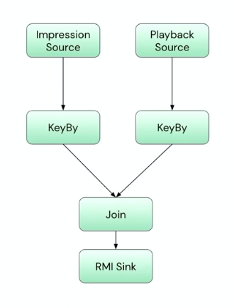
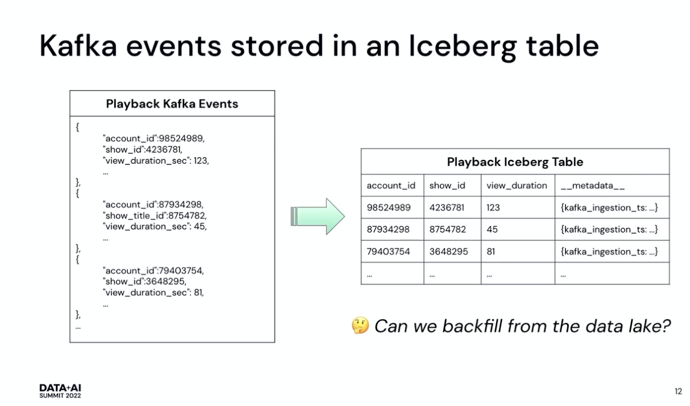
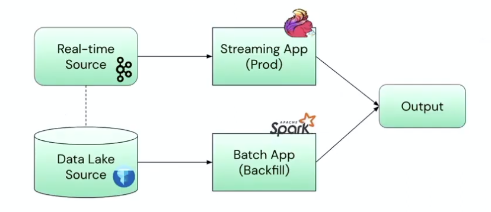
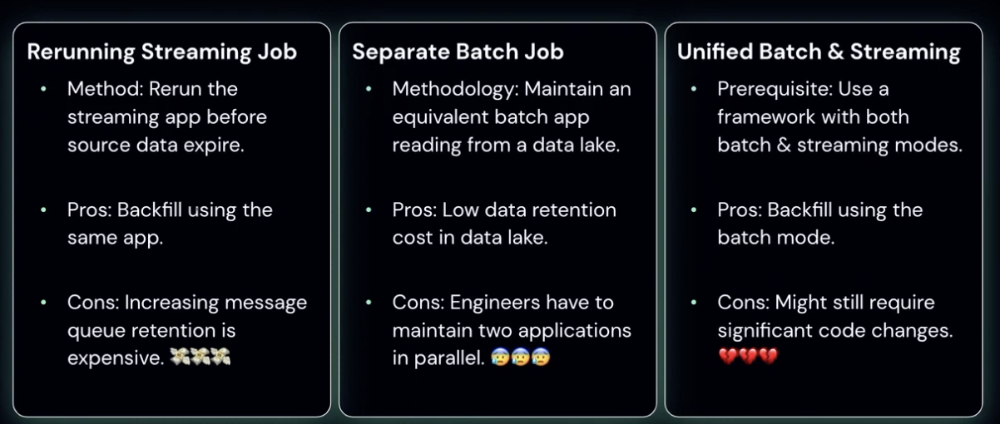
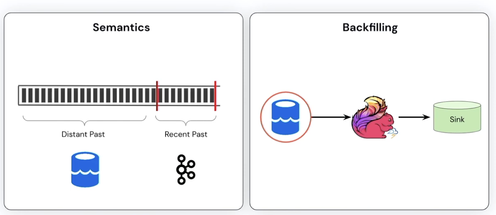
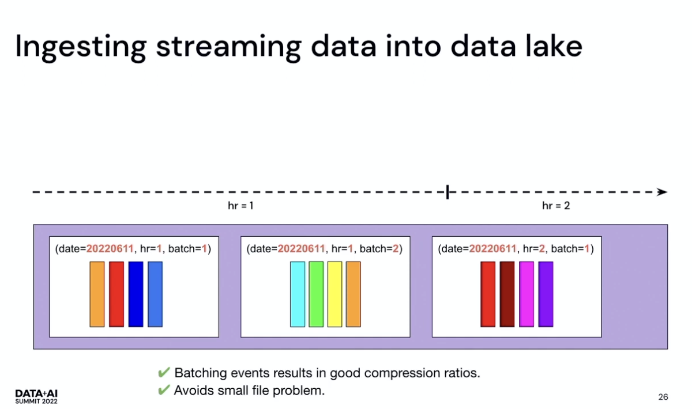
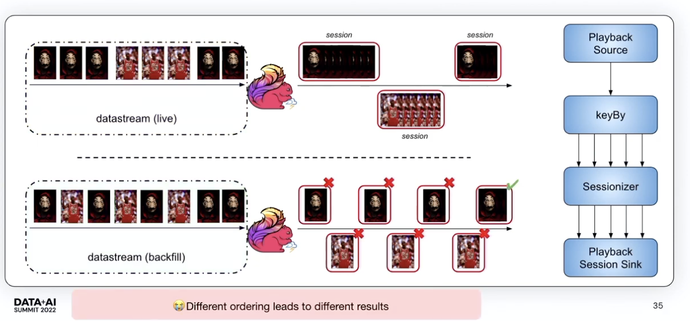
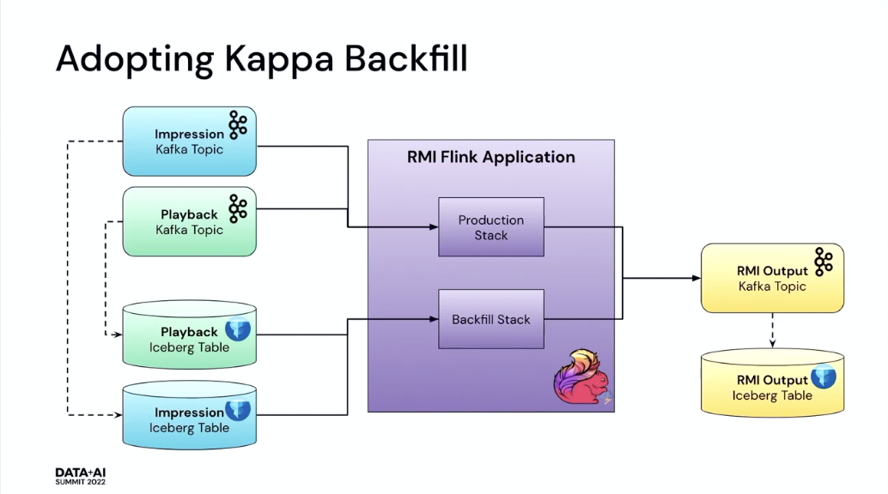

# Takeaways: [Backfilling Streaming Data Pipelines in Kappa Architecture @ Netflix](https://www.youtube.com/watch?v=aCIWI5k7deM)

## Background - Event Streaming

Build data systems to power data analytics and ML algorithms. Real time Merched Impression (RMI) Flink App:

- Join Impression events with Playback events in real-time to attributes plays to impressions to compute `Take Rate`.
- Use Case:
    1. Algo Training
    2. AB Testing
    3. etc.
- Pipeline
  

## Why we need Backfills

Event streaming operations and apps can fail due to various reasons:

1. Source / Sink failures
2. Dependent service failures
3. Upstream data changes

Thus we need to backfill to:

1. Correct wrong data
2. Backfill missing data
3. Bootstrap state for app to continue consuming live data

## How Should we Backfill?

### 1. Replaying Source Events

Easiest option since we are simply re-running the streaming job to reprocess events from a problematic period. However, we have to deal with:

1. Troubleshooting - Can take hours or days and source data can expire
2. Increasing message queue retention - Very expensive
    - Row based formats (E.g. Avro) have lower compression rate (v.s. Parquet / ORC)
    - Low-latency storage solutions (E.g. EBS gp2) are more costly (v.s. S3)
    - It would cost Netflix $93M/year to retain 30 days of data generated by all apps. So can we store it else where? Answer: Data Lake

### 2. Lambda Architecture

Building on longer message queue retention as a viable option we can use a Data Lake to service this together with the Lambda Architecture.

#### Data Lake for Longer Message Retention

Data Lakes are a central location for storing large amounts of data in its native raw format using a flat architecture and object storage

Why data lake?

1. **Cost Effective** - Compressed columnar formats like Parquet
2. **File Pruning**
3. **Schema Evolution**
4. **Engine Agnostic**
5. **Etc.**



We can build and maintain a batch-based application that is equivalent to the streaming application reading from our Data Lake Iceberg Tables and use it for Backfilling given its high throughput.



However the downside is:

1. Initial development of batch jobs can take days or weeks especially with data validation between the Batch and Streaming applications
2. Continuous engineering effort to ensure that the Batch app is up to date / in sync with the Streaming app.

### 3. Unified Batch and Streaming Framework

Use frameworks that supports both batch and streaming modes such as Flink or Beam.

However, Flink still requires significant code changes to run in batch mode and Beam only has partial support for state, timers and watermarks.

## Summary of Backfilling Options



## Backfilling in Kappa with Data Lake

### Goals

1. Obtain a generic solution that works for all classes of applications (Not tied to specific business logic)
2. Minimal code changes to add support
3. Scale horizontally to backfill quickly

### Overview



### Ingesting Streaming Data into a Data Lake

We batch our data instead of storing them individually to:

1. Efficient compression format compatible - Parquet / Orc
2. Avoid small file problem - Makes reading more efficient



### But how do we backfill?

#### Challenge 1: Applications assume Ordering



1. Strawman 1: Read Events from Files filtered by Backfill Dates
   - Positive - Scales horizontally to backfill quickly
   - Negative - Does not work for all types of applications

2. Strawman 2: Order all files and read them in order
   - Positive - Guarantees similar ordering semantics as Live Traffic
   - Negative - Does not scale horizontally (Bottlenecked by parallelism)

3. Netflix Solution[ADD IN DIAGRAMS]: Use lateness tolerated by the App (Read files while maintaining lateness constraints)
   - Positives:
     - Gurantees ordering that works for the application (Use event-time semantics unlike Kafka's strict ordering)
     - Scales horizontally to finish backfill quickly
     - Alignment across sources to avoid state size explosion (See below)

#### Challenge 2: Reading from Multiple Sources

When we read from multiple sources like a `playback source` and an `impression source`, one source can have significantly more data than the other (**'Data Skew'**).

Thus during a backfill operation this could lead to a **Watermark Skew** resulting in a `State size explosion`. Consequently resulting in **slow checkpoints** or **checkpoint timeouts**.

Netflix solves this by **Coordinating watermarks** and using a **Global Watermark**

- Use the earliest watermark

### Adopting Kappa Backfill

#### Overview of Production Applcation



This enables minimal code changes as shown:

```java
@SpringBootApplication
class PersonalizationStreamingApp {

   @Bean
   def flinkJob(
      @Source("impression-source") impressionSource: SourceBuilder[Record[ImpressionEvent]],
      @Source("playback-source") playbackSource: SourceBuilder[Record[PlaybackEvent]],
      @Sink("summary-sink") summarySink: SinkBuilder[ImpressionPlaySummary]) {...}

   @Bean
   def liveImpressionSourceConfigurer(): KafkaSourceConfigurer[Record[ImpressionEvent]] = new KafkaSourceConfigurer("live-impression-source", KafkaCirceDesrializer[ImpressionEvent])

   @Bean
   def backfillImpressionSourceConfigurer(): IcebergSourceConfigurer[Record[ImpressionEvent]] = new IcebergSourceConfigurer(
      "backfill-impression-source",
      Avro.deserializerFactory(ImpressionEvent)
   )
}
```

***Note: In-memory representation of the Iceberg source is consistent with the Kafka Source thus no change in processing logic is necessary plus cost savings with Apache Iceberg***

#### Results of Kappa Backfill

1. High throughput - 24 hours of data takes only ~5 hours
2. Consistent data quality: Backfill output matches 99.9% of production

#### Lessons Learnt

1. Backfilling window and configs depend on application logic - E.g. Stateful jobs will require sufficient amount of data to build up sufficient state
2. Backfilling job needs separate tuning form Production job - During backfills data flows through at a higher rate so we can allocate more resources
3. Backfill can product more correct results than in production - Due to how Flink watermarks work etc.
